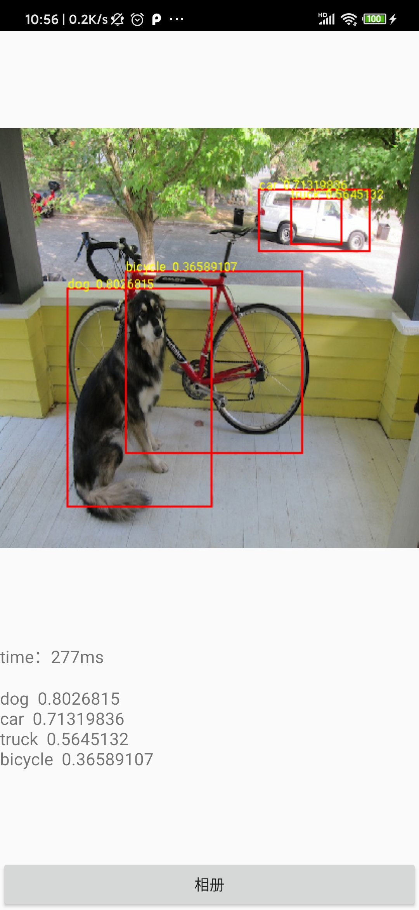

Android demo to use darknet model in ncnn. 

Steps:

1. Use [darknet2ncnn](https://github.com/xiangweizeng/darknet2ncnn) to convert darknet model to ncnn model.
2. Build [xiangweizeng/ncnn](https://github.com/xiangweizeng/ncnn) for android.
3. Put model, ncnn header files and static lib into project.

Reference: https://github.com/chehongshu/ncnnforandroid_objectiondetection_Mobilenetssd

For vulkan support: https://github.com/nihui/ncnn-android-styletransfer
